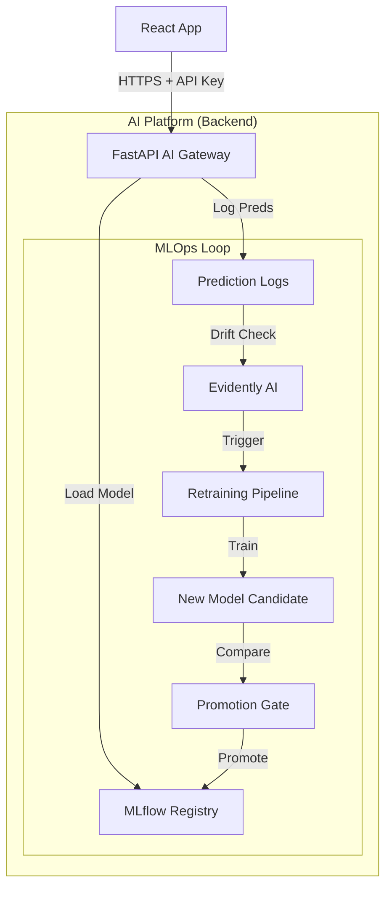

# End-to-End MLOps System for Clinical Trial Dropout Risk Prediction

[](https://github.com/USERNAME/REPO/actions)
[](https://www.python.org/downloads/release/python-3100/)
[](https://www.docker.com/)
[](https://opensource.org/licenses/MIT)

## Overview
This project implements a **production-grade MLOps pipeline** to predict patient dropout risk in clinical trials. The system is designed for high-recall, risk-sensitive healthcare environments, ensuring that critical retention interventions are triggered accurately.

It is built not just as a model, but as a **complete AI platform**:
- **Backend**: Secure, scalable FastAPI AI service.
- **Frontend Integration**: Secure API consumed by React applications.
- **Operations**: Fully automated CI/CD, drift monitoring, and self-healing retraining loops.

## Key Capabilities
- **Risk-Aware Modeling**: Logistic Regression / XGBoost optimized for Recall (0.66 ROC-AUC).
- **Threshold Policy**: Dynamic decision thresholds (configurable via Kubernetes ConfigMaps).
- **Automated Governance**:
  - **MLflow Model Registry** for version control.
  - **Strict Quality Gates**: Candidate models must outperform production >2%.
  - **Drift Detection**: Evidently AI monitors data and triggers auto-retraining.
- **Production Infrastructure**:
  - Dockerized microservice architecture.
  - **Kubernetes** manifests for scalable deployment (HPA, Rolling Updates).
  - **Security Hardened**: API Key auth, hashed PII logging, non-root containers.

## Architecture

The system follows a strict separation of concerns:
**Frontend (React)** only sees a secure API. **Backend** handles all ML complexity.



### Risk Strategy (Healthcare Focused)
In clinical trials, missing a dropout is costly (failed trial), while a false alarm is cheap (extra nurse call).
- **Optimization Target**: Recall (Sensitivity)
- **Decision Threshold**: Aggressive (e.g., 0.30) to catch at-risk patients early.
- **Intervention Tiers**:
  - **Low Risk**: Automated SMS.
  - **Medium Risk**: Nurse call.
  - **Critical Risk**: On-site intervention.

## Tech Stack
| Component | Technology |
| :--- | :--- |
| **Model** | Logistic Regression, XGBoost (Scikit-Learn) |
| **Backend** | FastAPI, Uvicorn, Pydantic |
| **MLOps** | MLflow, DVC, GitHub Actions |
| **Infrastructure** | Docker, Kubernetes (Minikube/EKS), AWS EC2 (Free Tier compatible) |
| **Monitoring** | Evidently AI, Custom "Decision Brain" |
| **Testing** | Pytest, Flake8 |

## Repository Structure
```
mlops-clinical-dropout/
├── api/                  # FastAPI service (The Product)
├── src/                  # Core ML logic (Training, Preprocessing)
├── data/                 # Data assets (DVC tracked)
├── monitoring/           # Drift detection & Retraining Brain
├── pipelines/            # CI/CD Pipeline logic
├── k8s/                  # Kubernetes manifests (Deployment, HPA)
├── config/               # Policy configuration (YAML)
├── Dockerfile            # Production-optimized image
└── docs/                 # Architectural documentation
```

## Getting Started

### 1. Run Locally (Docker)
```bash
# Build production image
docker build -t dropout-api .

# Run container (simulating production env)
docker run -p 8000:8000 \
  -e API_KEY=dev-secret-key \
  -e MODEL_PATH=models/production_model.pkl \
  dropout-api
```

### 2. Run Automation Loop
Trigger the monitoring and retraining system manually:
```bash
# generate drift
python monitoring/run_drift.py 

# check if retraining needed
python monitoring/should_retrain.py
```

### 3. Deploy to Kubernetes
```bash
kubectl apply -f k8s/
```

## API Usage (Frontend Integration)

The API is ready for React/Next.js integration.

**Endpoint**: `POST /predict`
**Auth**: `x-api-key: <YOUR_KEY>`

```javascript
// React Example
const response = await fetch("https://api.your-domain.com/predict", {
  method: "POST",
  headers: {
    "Content-Type": "application/json",
    "x-api-key": process.env.REACT_APP_API_KEY
  },
  body: JSON.stringify({
    patient_id: "P-001",
    age: 65,
    days_in_trial: 45,
    visits_completed: 3,
    adverse_events: 1
  })
});

const data = await response.json();
// Returns: { dropout_prediction: 1, probability: 0.78, risk_level: "Critical" }
```

## Contact
**Engineer**: [Your Name]
**Role**: AI Architect / MLOps Engineer
